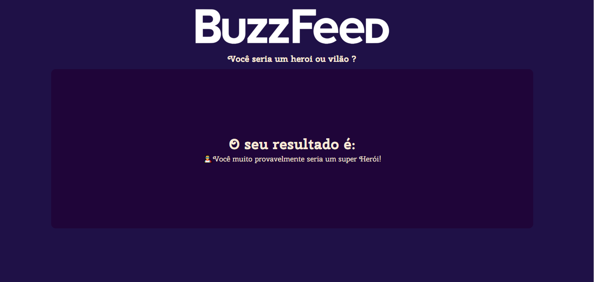

# Buzzfeed Quizz Clone

## Criando projeto
```
  ng new buzzfeed-quizz-clone
```

## Criando componentes
```
  ng g c components/quizz
  ng g c pages/home
```
## Visual do projeto
<p align="center">
  
</p>
<p align="center">
  
</p>
