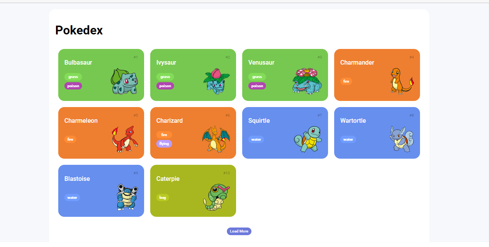

# Construindo uma Pokédex com JavaScript
Neste projeto, desenvolvemos uma lista de pokémons onde os dados são consumidos pelo aplicativo PokeApi.

## Visual do projeto

  

## Links Úteis
https://necolas.github.io/normalize.css/

### cdn do normalize
https://cdnjs.com/libraries/normalize