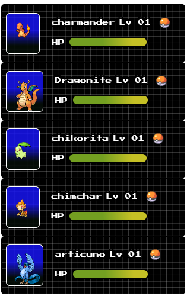

# Componentizando uma Aplicação com Angular
Criando componente card do pokémon.

Para codar o código foi usada o editor stackblitz.

## Visual do card

  

## Links Úteis
https://www.fronteditor.dev

https://stackblitz.com/