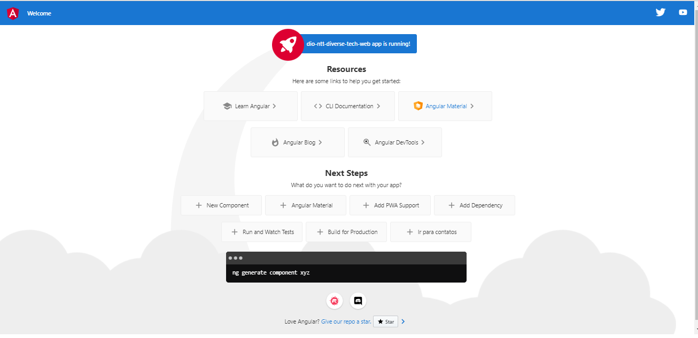

# Deploy de Aplicação Angular na AWS
Criando um projeto em angular e fazendo deploy no AWS utilizando o serviço S3.

<p>
  
</p>

## Steps
1. Criar o projeto Angular
```
  npm install -g @angular/cli

  ng new dio-ntt-diverse-tech-web

  ng build - gerar arquivos para distribuir para produção para poder acessar a minha página
```

2. Realizar upload dos arquivos gerados no S3
```
  Criar um bucket do nome dio-ntt-diverse-tech

  Adicionar os arquivos gerados no bucket

  Permitir acesso público aos objetos do bucket

  Habilitar static website hosting
```

3. Adicionar nova rota no projeto web
```
  Criar componentes home e contatos:  
    ng generate component home
    ng g c contatos
  
  Recortar HTML do app.component.html e adicionar no home.component.html

  Copiar e colar o conteúdo do export class do app.component.ts no home.component.ts

  Adicionar as rotas default e contatos no app.routing.module.ts

  Adicionar o botão que redireciona para a rota de contatos, dentro do HTML do home.component.html
```

## Rodar a aplicação
```
  ng serve --open
```

## CodePipeline

# Steps
1. Criar um repositório para o projeto no CodeCommit
```
  Após criar o projeto, deve-se realizar o commit inicial: 
    git add .  

    git commit -m "initial commit"

    git remote add origin URL_DISPONIVEL_CODE_COMMIT

  git push -u origin master
```

2. Criar um projeto no CodePipeline
```
  Definir o nome do projeto
  
  Criar um service role default
```

3. Selecionar o source provider para CodeCommit
```
  Selecionar o projeto web

  Selecionar a branch que será usada para na pipeline
```

## CodeBuild
Steps
1. Criar projeto CodeBuild e configurar o processo de build da aplicação, com o buildspec.yml abaixo:

```
version: 0.2
  phases:
    install: 
      commands: 
        - echo Installing source NPM dependencies...
        - npm install
        - npm install -g @angular/cli
    build: 
      commands:
        - echo Building application...
        - ng build
    artifacts:
      files:
        - '**/*'
      base-directory: 'dist*'
      discard-paths: yes
```

## Links usados
  https://angular.io/guide/setup-local

  https://codebeautify.org/yaml-beautifier
